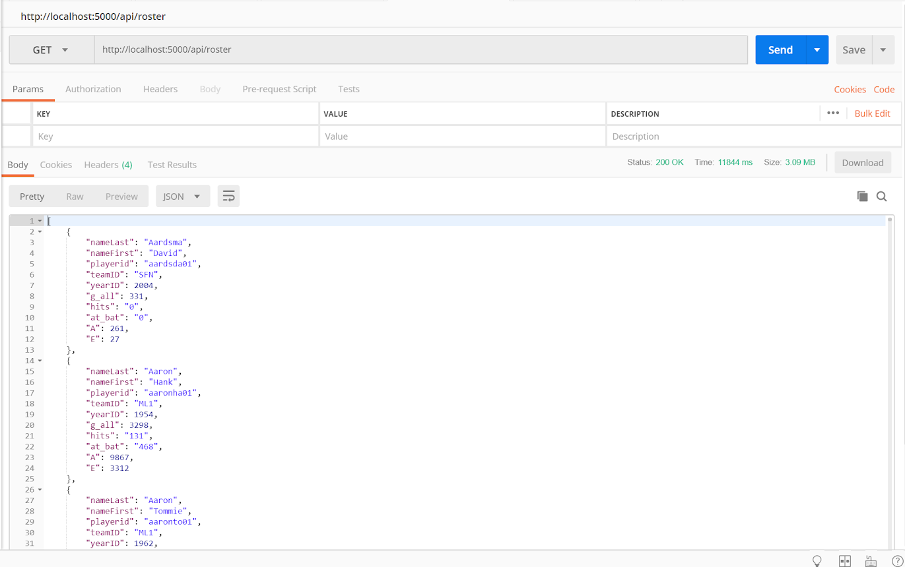

# REST-API-on-Relational-Database
 Implemented a general framework and solution for surfacing relational data via a REST API. 
 The implementation supported mapping HTTP POST, GET, PUT and DELETE on resources to the 
 corresponding SQL operations on the relational tables (SELECT, INSERT, UPDATE, DELETE). 
 The framework mapped between relational data and application/JSON. The framework read 
 metadata about tables to implement mapping of URL endings to primary keys and to follow 
 resource paths based on foreign keys.

Program demonstration using Postman:  
GET with query parameters and fields
		/api/<resource>[query_expression],[&field_expression]
    
    

PUT: /api/<resource>/<primary_key> updates the resource (row).

DELETE: /api/<resource>/<primary_key> deletes the identified resource.

/api/teammates/willite01

/roster:

